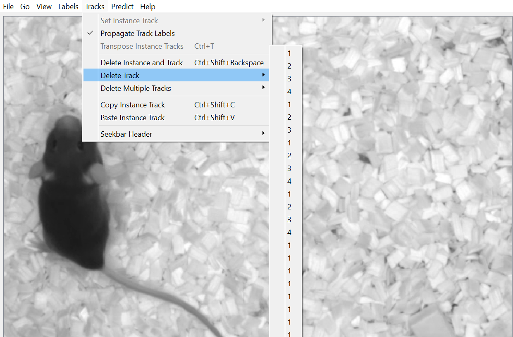

## Fix SLEAP tracks

### Issue
In SLEAP 1.4.1, tracks with the same name might be duplicated after merging-in predictions files into training projects, which makes annotating for supervised ID models training hard.

Using `Delete Mulitple Tracks` -> `Unused` does not work in this cases, since the duplicate tracks **are** actually used.

The issue appears like:

### Fix
The fix maps all tracks in a SLEAP project back to the unique tracks (by name) and saves a new file *<your-sleap.slp>*_fixed.slp

### Usage 
Using [uvx](https://docs.astral.sh/uv/guides/tools/) you can fix your *<your-sleap.slp>* file by:

    uvx --from https://github.com/sommerc/fix_sleap_tracks.git fix-sleap-tracks *<your-sleap.slp>*

without the need of installing Python, Venv, conda etc.

